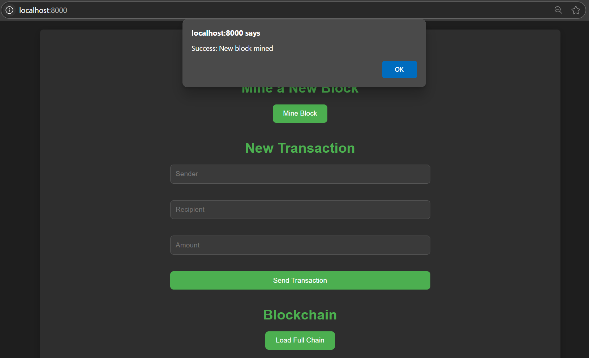
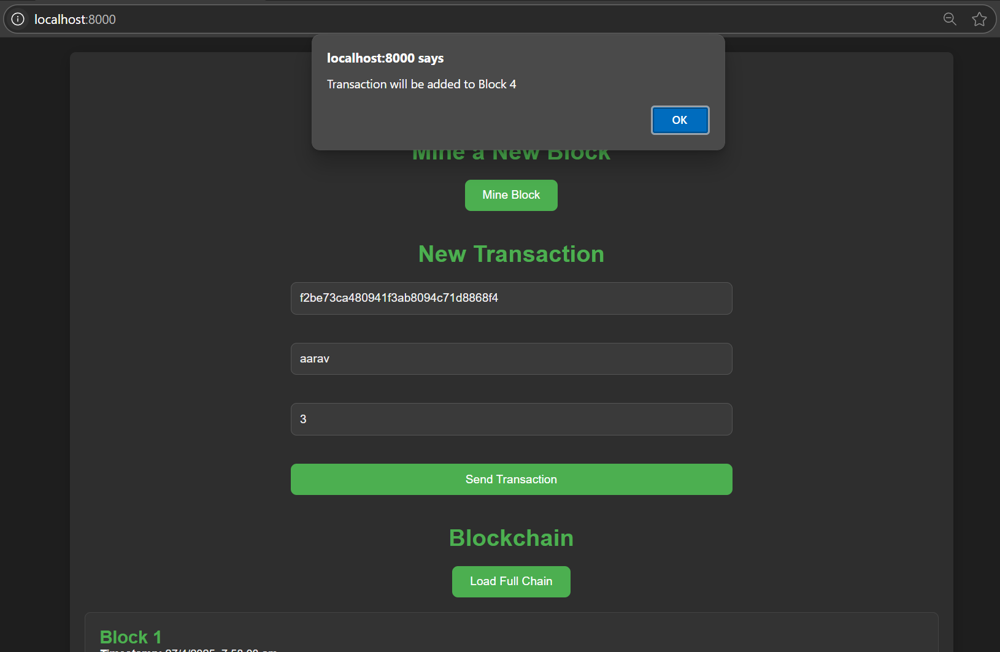
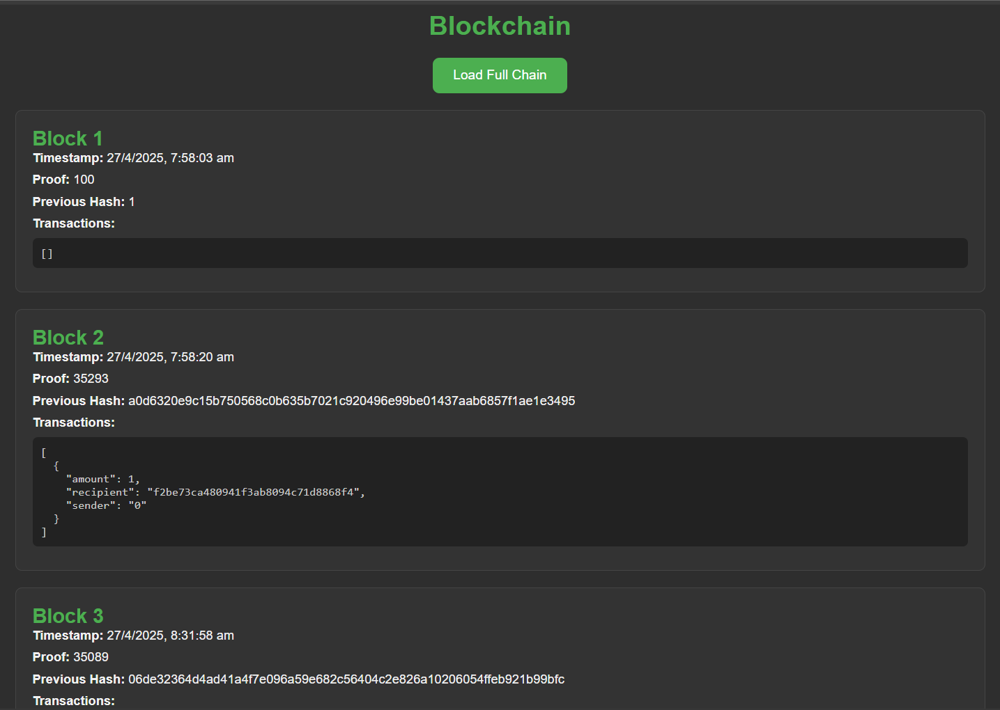
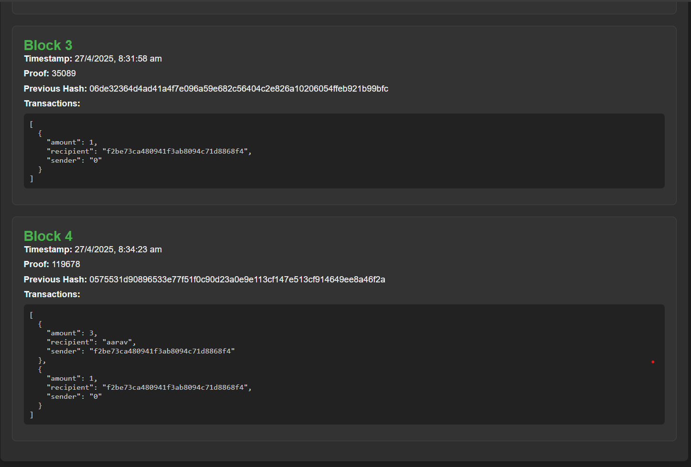

# 🧱 Simple Blockchain Project
This project is a basic blockchain implementation with a Flask backend and a simple HTML/CSS/JS frontend.
It demonstrates core blockchain concepts like proof of work, mining blocks, transactions, and chain visualization.

## 📂 Project Structure
Backend: Python + Flask (blockchain.py)

Frontend: HTML/CSS/JavaScript (index.html)

## 🚀 Features
Create and mine new blocks (/mine)

Create new transactions (/transactions/new)

View the entire blockchain (/chain)

Simple Proof of Work system (find a hash with 4 leading zeros)

Responsive, dark-themed frontend to interact with the blockchain

Basic Node registration and Consensus API structure (consensus not fully implemented)

## 🛠 How to Run
#### 1. Backend Setup
-Make sure you have Python 3.x installed.

-Install required Python packages:

```bash
pip install flask flask-cors
```
-Run the Flask server:

```bash
python blockchain.py
```
The backend will start on http://localhost:5000.

#### 2. Frontend Setup
Open the index.html file directly in your browser.
(No server needed — the frontend is purely static.)

Make sure the backend is running (localhost:5000) because the frontend communicates with it via APIs.

### 📋 API Endpoints

| Method | Endpoint               | Description                       |
|--------|------------------------|-----------------------------------|
| GET    | `/mine`                | Mines a new block                |
| POST   | `/transactions/new`    | Creates a new transaction        |
| GET    | `/chain`               | Retrieves the full blockchain    |

### ✨ Screenshots
##### Here is a screenshot of the frontend interacting with the blockchain after mining a new block:



##### Here is a screenshot of the frontend interacting with the blockchain after pushing a new transaction:


##### Here is a screenshot of the full chain:


### 📚 Concepts Used
Blockchain basics

Proof of Work

Flask APIs

Fetch API (JavaScript) to call backend

Basic blockchain consensus idea (structure laid out)

### 📦 Future Improvements
Implement full consensus algorithm for resolving chain conflicts

Improve security of transactions

Add Node-to-Node communication

Add block explorer features on the frontend

### 🤝 Acknowledgements
This project is inspired by basic blockchain concepts.

Thanks to Flask for making API creation super easy!
